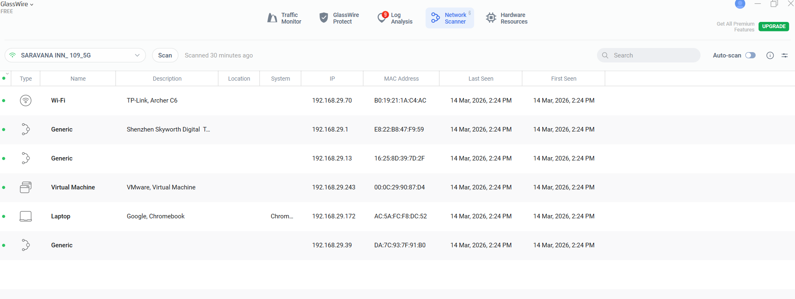
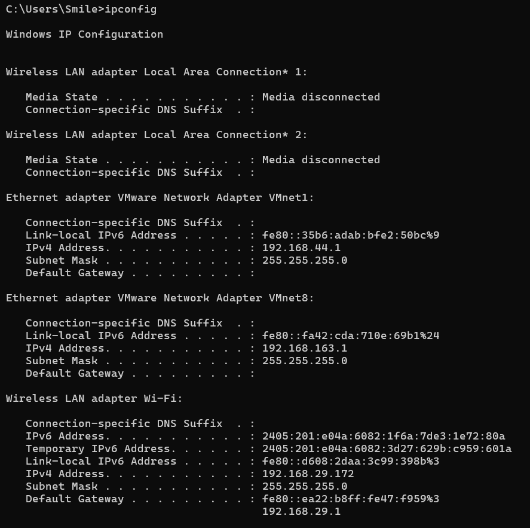
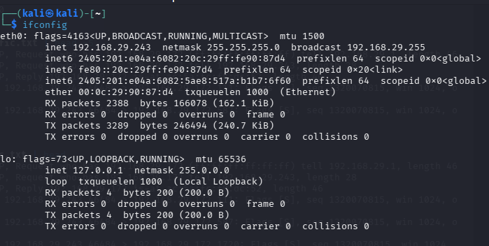
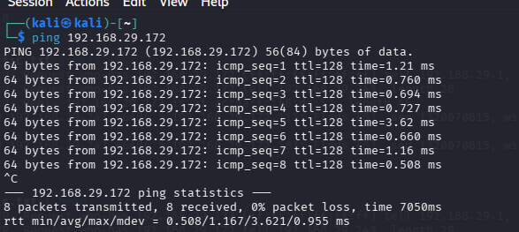
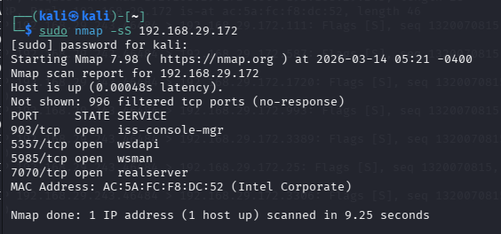
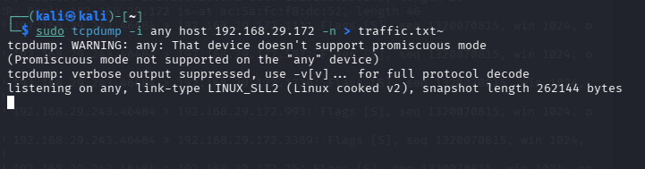
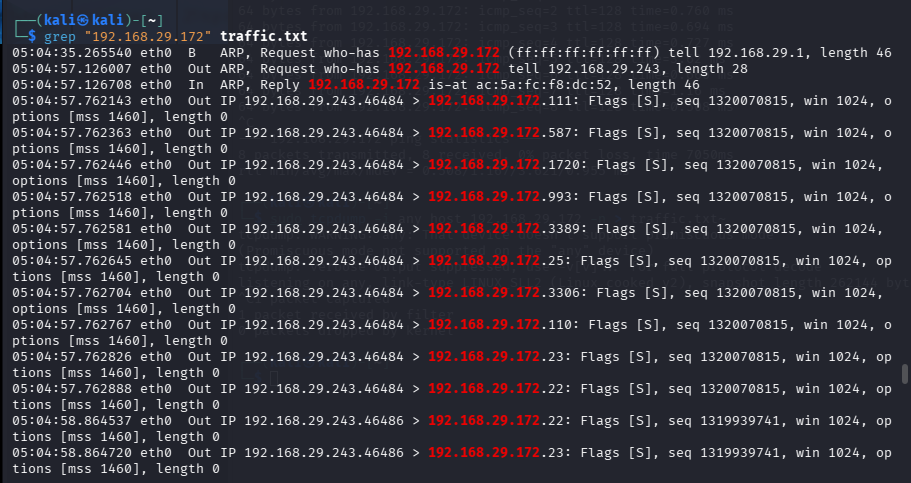

# Firewall Traffic Analysis Lab

This lab demonstrates how network traffic can be generated, captured, and analyzed to observe scanning behavior and investigate network communication.

## 1. Network Device Discovery

GlassWire was used to identify active devices on the network.

## 2. Target System Identification

The target system IP address was identified using Windows `ipconfig`.

## 3. Attacker Machine Identification

The attacker machine IP address was confirmed using Kali `ifconfig`.

## 4. Connectivity Test

Connectivity to the target host was verified using:
ping 192.168.29.172

## 5. Port Scanning

A SYN scan was performed to identify open ports.

sudo nmap -sS 192.168.29.172

## 6. Packet Capture

Network traffic was captured using tcpdump.

sudo tcpdump -i any host 192.168.29.172

## 7. Traffic Analysis

Captured packets were filtered to analyze communication patterns.

grep "192.168.29.172" traffic.txt

## Result

The analysis revealed SYN packets generated during the Nmap scan and ARP
